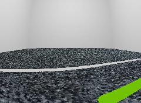
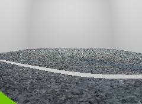

[](https://travis-ci.org/ironcarocto/simulateur_ironcar)

Ce simulateur permet de générer un dataset préqualifié d'images de
route tel que la verrait la caméra d'une **ironcar** associées à la commande de direction pour l'ironcar.

[Ironcar](http://ironcar.org/) est un championnat de courses de voitures
autonomes en modèle réduit !

__2 exemples de sortie de simulateur_ironcar__



## Dernière version du code source de ce programme

```bash
git clone https://github.com/ironcarocto/simulateur_ironcar.git
```

## Utiliser le simulateur

1. Installer le simulateur avec pip

```bash
pip install git+https://github.com/ironcarocto/simulateur_ironcar.git
```

2. Créer un dossier pour un profil de génération de route
3. Initialiser un profile de génération de route


```bash
simulateur_ironcar init
```

Vous devez obtenir le dossier suivant

```
.
├── configuration.json
├── grounds
│   ├── IMG_1417.JPG
│   └── IMG_5993.JPG
└── photos
```

* le dossier ``grounds`` contient les terrains sur lesquels vous voulez générer des routes

4. Configurez votre profile de génération de route

    1. placez de nouveaux grounds dans le dossier ``ground``
    2. configurez les valeurs souhaités dans le fichier ``configuration.json``

## Contribuer au projet

1. créer un environnement virtuel

```
virtualenv venv -p python3
```

2. installer les dépendances de développement

```bash
. venv/bin/activate; pip install -e .[dev]
```

3. exécuter les tests

```bash
. venv/bin/activate; pytest
```

## License

MIT License

Copyright (c) 2019 Constant Bridon

Permission is hereby granted, free of charge, to any person obtaining a copy
of this software and associated documentation files (the "Software"), to deal
in the Software without restriction, including without limitation the rights
to use, copy, modify, merge, publish, distribute, sublicense, and/or sell
copies of the Software, and to permit persons to whom the Software is
furnished to do so, subject to the following conditions:

The above copyright notice and this permission notice shall be included in all
copies or substantial portions of the Software.

THE SOFTWARE IS PROVIDED "AS IS", WITHOUT WARRANTY OF ANY KIND, EXPRESS OR
IMPLIED, INCLUDING BUT NOT LIMITED TO THE WARRANTIES OF MERCHANTABILITY,
FITNESS FOR A PARTICULAR PURPOSE AND NONINFRINGEMENT. IN NO EVENT SHALL THE
AUTHORS OR COPYRIGHT HOLDERS BE LIABLE FOR ANY CLAIM, DAMAGES OR OTHER
LIABILITY, WHETHER IN AN ACTION OF CONTRACT, TORT OR OTHERWISE, ARISING FROM,
OUT OF OR IN CONNECTION WITH THE SOFTWARE OR THE USE OR OTHER DEALINGS IN THE
SOFTWARE.
